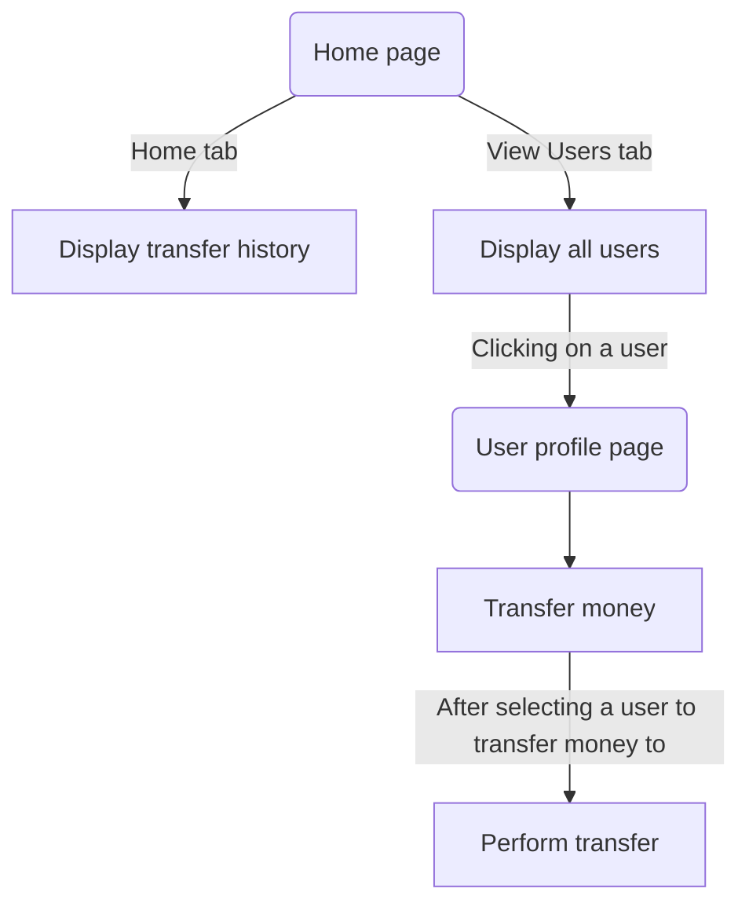
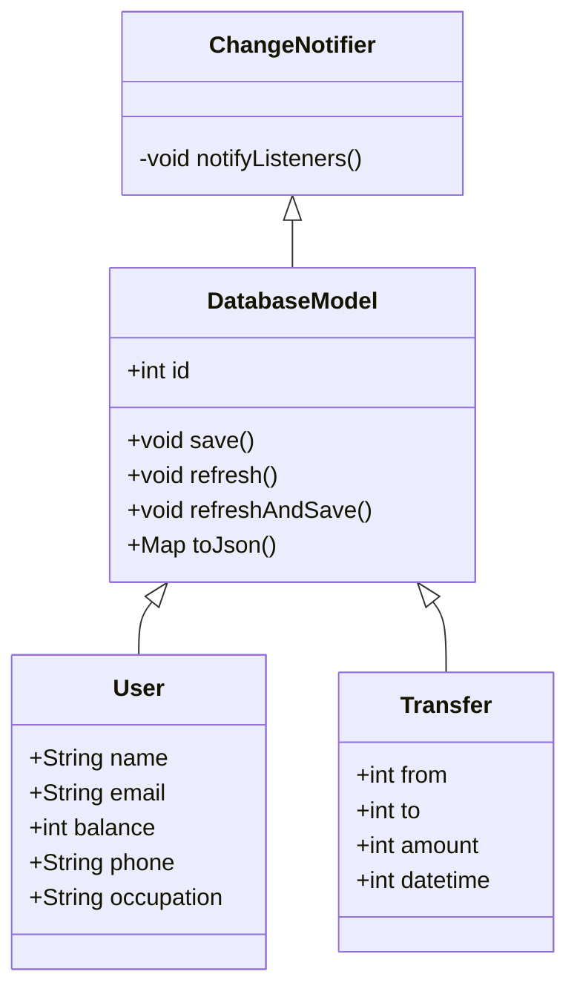

# Basic Banking App (made with Flutter)  

Programmed by [**Saumitra Topinkatti**](https://www.linkedin.com/in/saumitra-topinkatti-45a577208/).

## Problem Statement  

To create a banking mobile app with basic functionality of transferring money from one user to another.  

## Essential packages used!  

- [sqflite](https://pub.dev/packages/sqflite) (sqlite for flutter)
- [provider](https://pub.dev/packages/provider) (state management)
- [intl](https://pub.dev/packages/intl) (localization and formatting date or time)

## Page flow  

## Model layout   

## Project file structure

- [**lib**](https://github.com/SBTopZZZ-LG/flutter-banking_app/tree/main/lib)
  - [**configs** (contains configuration)](https://github.com/SBTopZZZ-LG/flutter-banking_app/tree/main/lib/configs)
    - [**colours.dart**](https://github.com/SBTopZZZ-LG/flutter-banking_app/tree/main/lib/configs/colours.dart)
    - [**users.dart**](https://github.com/SBTopZZZ-LG/flutter-banking_app/tree/main/lib/configs/users.dart)
  - [**models** (contains basic data models)](https://github.com/SBTopZZZ-LG/flutter-banking_app/tree/main/lib/models)
    - [**database.model.dart**](https://github.com/SBTopZZZ-LG/flutter-banking_app/tree/main/lib/models/database.model.dart)
    - [**transfer.dart**](https://github.com/SBTopZZZ-LG/flutter-banking_app/tree/main/lib/models/transfer.dart)
    - [**user.dart**](https://github.com/SBTopZZZ-LG/flutter-banking_app/tree/main/lib/models/user.dart)
  - [**pages** (contains app pages)](https://github.com/SBTopZZZ-LG/flutter-banking_app/tree/main/lib/pages)
    - [**home.page** (home.page.dart elements)](https://github.com/SBTopZZZ-LG/flutter-banking_app/tree/main/lib/pages/home.page)
      - [**home.dart** (Home tab)](https://github.com/SBTopZZZ-LG/flutter-banking_app/tree/main/lib/pages/home.page/home.dart)
      - [**view.users.dart** (View users tab)](https://github.com/SBTopZZZ-LG/flutter-banking_app/tree/main/lib/pages/home.page/view.users.dart)
    - [**home.page.dart** (Home page)](https://github.com/SBTopZZZ-LG/flutter-banking_app/tree/main/lib/pages/home.page.dart)
    - [**user.page.dart** (User profile page)](https://github.com/SBTopZZZ-LG/flutter-banking_app/tree/main/lib/pages/user.page.dart)
  - [**utils** (contains utilities)](https://github.com/SBTopZZZ-LG/flutter-banking_app/tree/main/lib/utils)
    - [**sqlite.dart**](https://github.com/SBTopZZZ-LG/flutter-banking_app/tree/main/lib/utils/sqlite.dart)
  - [**widgets** (contains custom widgets)](https://github.com/SBTopZZZ-LG/flutter-banking_app/tree/main/lib/widgets)
    - [**clipper.dart**](https://github.com/SBTopZZZ-LG/flutter-banking_app/tree/main/lib/widgets/clipper.dart)
  - [**main.dart** (Entrypoint)](https://github.com/SBTopZZZ-LG/flutter-banking_app/tree/main/lib/main.dart)   

## Brief description  

At the beginning of the app, [sqlite.dart](https://github.com/SBTopZZZ-LG/flutter-banking_app/tree/main/lib/utils/sqlite.dart) initializes the database required to create and store new records (such as new transfers) by creating the database file and running queries to create the necessary tables, after which a list of sample users is generated in **users** table. A table for **transfers** is created as well, but is left unfilled.  

After the setup is complete (first run initialization), user can begin using the app to perform the basic actions like viewing transfer history, viewing users, viewing user profile, and making transfers. Once user commits a transfer from one user to another, the user details (for both users) is updated with the specified amount and is immediately saved. Simultaneously, a record of transfer is created with the necessary details, which is finalized by appending to the **transfers** table.  

The app also displays warning pop-ups wherever needed. For example, when trying to transfer money from an account with no money.

When models perform operations like saving, refreshing, or even inserting, the same is notified to the UI and the components are re-built, thus displaying the updated information.

#### So users are being generated randomly?

No, this is where the [configs](https://github.com/SBTopZZZ-LG/flutter-banking_app/tree/main/lib/configs) come in handy. All users are generated by referring from the config file [users.dart](https://github.com/SBTopZZZ-LG/flutter-banking_app/tree/main/lib/configs/users.dart).

#### But Saumitra since you're saving three models at once, you're re-building the UI three times  

Yes that's inefficient and refreshing widgets that aren't necessarily being changed is a bad practice. To implement a better state management, I use the [provider](https://pub.dev/packages/provider) package to implement this for me. Using provider, only the widgets that access the specific model are refreshed and other widgets are left aside. For example, saving a user model results in re-building of the user tile that depends on that user model.
